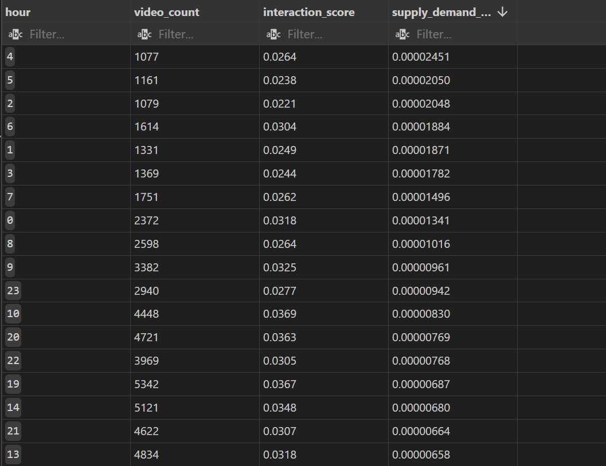

## DaliyGrowth
通过**DailyGrowth**，可查询高爆发视频，设置参数（growth_rate为参数增长倍数）为播放量在上榜后一天内翻了一倍以上的视频，可关注视频热点，进行热点相关推流

同时，异常名字#NAME?为多国语言标题转化出现的异常量，应当忽略

## HourlyActivity
通过**HourlyActivity**，可查询互动率（互动量/播放量）较高，供需比较高的时间段，如图所示，中午10-12点，傍晚18-20点均是显著的高互动率时段，

按供需比（互动量/发布视频数）可看出，尽管傍晚18-20点为发布高峰时段，但依旧互动率较高，相反凌晨尽管供需比较高，但互动率倒数，不是适合发布的时段

## LifeSpan
通过**LifeSpan**,可查询长尾（上榜时间大于三天）爆款视频（单日上榜）数据

其中按分区占比分化显著，爆款视频中新闻政治，娱乐八卦均在前三位

## VideoStats
通过**VideoStats**，可查询赞与评论四象限，实现视频流量定点投放和舆情监控，高赞高评视频可能质量较高可以进一步推流，低赞低评视频可能出现舆情。

下为查询高赞高评视频具体id

